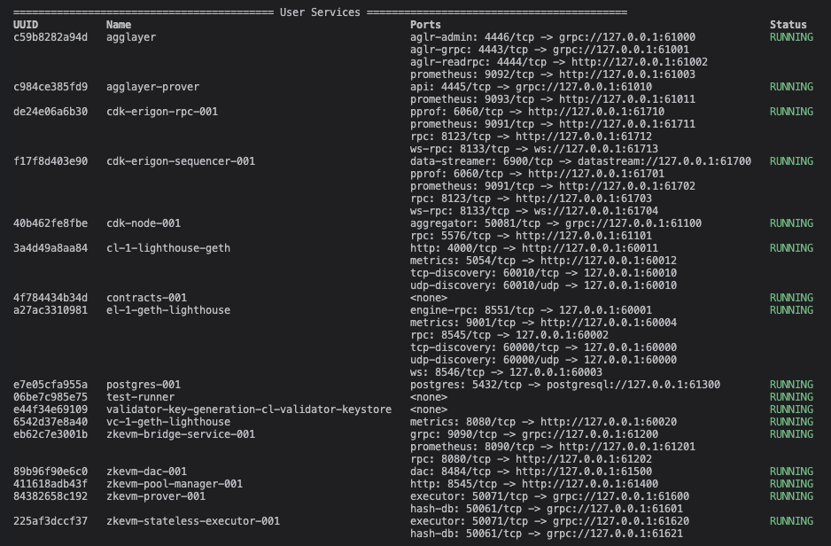

# 🔗 L2 Local Testing & Deployment Framework  
**Tools used:** Kurtosis CDK · Docker · Foundry · Node.js · Ethers.js · Jest · Axios

---

## 🛠️ Prerequisites

#### Ensure your machine meets the following:

- ✅ At least **16 GB of RAM**
- ✅ [**Node.js**](https://nodejs.org/en) installed (>= v20.\*)
- ✅ [**Foundry**](https://book.getfoundry.sh/getting-started/installation) installed
- ✅ [**Docker**](https://docs.docker.com/get-docker/) installed (>= v4.27.0)
- ✅ [**jq**](https://github.com/jqlang/jq) installed
- ✅ [**Kurtosis CLI**](https://docs.kurtosis.com/install/) installed
- ✅ [**pnpm**](https://pnpm.io/installation) installed

---

## Table of Contents
- [⚙️ **Setting Up Local L1 & L2 Using Kurtosis CDK**](#⚙️-setting-up-local-l1--l2-using-kurtosis-cdk-that-based-on-cdk-erigon)
- [🛠️ **MacOS (Apple Silicon) Troubleshooting**](#🛠️-macos-apple-silicon-troubleshooting)
- [🧵 **End-to-End Deployment and Testing Script**](#🧵-end-to-end-deployment-and-testing-script)
- [🧪 **Manual & Dedicated Stage-by-Stage Test Flows**](#🧪-manual--dedicated-stage-by-stage-test-flows)
- [🧰 **Additionally, Unit Tests on Foundry for Smart Contracts**](#🧰-additionally-unit-tests-on-foundry-for-smart-contracts)

---

## ⚙️ Setting Up Local L1 & L2 Using Kurtosis CDK (that based on [cdk-erigon](https://github.com/0xPolygonHermez/cdk-erigon))

> Steps based on [kurtosis-cdk](https://github.com/0xPolygon/kurtosis-cdk)

### Clone Kurtosis CDK Repo (tags/v0.4.4)

```bash
git clone https://github.com/0xPolygon/kurtosis-cdk.git
```

```bash
cd kurtosis-cdk
```

### 🧪 To have a static port for local RPC URL `http://127.0.0.1:61712` (better for testing), run Kurtosis with a custom args file:

```bash
kurtosis run --enclave cdk github.com/0xPolygon/kurtosis-cdk --args-file ./.github/tests/nightly/static-ports/custom-static-ports.yml
```

### 🏗️ Once completed, you'll see the **User Services** running successfully (it takes around 5-8 minutes to spin up L1 and L2)




### 🛑 To Shutdown the Kurtosis Node

```bash
kurtosis clean --all
```

## 🛠️ MacOS (Apple Silicon) Troubleshooting

### ❗ Problem 1: AMD64 Image Compatibility

#### Kurtosis uses amd64 images, which may not run on M chips

### ✅ Solution

1. **Install Rossetta:** 
   ```bash
   softwareupdate --install-rosetta --agree-to-license
   ```

2. **Enable Rosetta support in Docker:**
   - Go to **Docker Settings → General**
   - Enable: `Use Rosetta for x86_64/amd64 emulation on Apple Silicon`
   - Click **Apply & Restart**

3. **Manually pull the necessary Docker images:**

   ```bash
   docker pull --platform=linux/amd64 hermeznetwork/zkevm-prover:v8.0.0-RC16-fork.12
   docker pull --platform=linux/amd64 leovct/e2e:78df008-cdk
   ```

### ❗ Problem 2: Default L2 Contract Deployment Process Stuck

#### If the deployment process gets stuck, it is likely due to Docker’s default memory limit being too low (8GB).<br /> Increase Docker memory allocation to at least **16GB or 24GB** (32GB recommended) to fix this issue.

#### ✅ How to increase Docker memory:

- Go to **Docker Settings**
- Open the **Resources** tab
- Increase the **Memory** limit
- Ensure the **CPU** limit is at least **4**
- Click **Apply & Restart**

#### 🔄 Once Docker is ready, run the Kurtosis command again.

```bash
kurtosis run --enclave cdk github.com/0xPolygon/kurtosis-cdk --args-file ./.github/tests/nightly/static-ports/custom-static-ports.yml
```

---

### ℹ️ Additional: Getting Erigon RPC URL

If you need the Erigon RPC URL (static URL is usually `http://127.0.0.1:61712`), run:

```bash
kurtosis port print cdk cdk-erigon-rpc-001 rpc
```

---

## 🧵 End-to-End Deployment and Testing Script

Before running tests, install required dependencies for the repo:

```bash
pnpm i
```

Run to create `.env` from example file:

```bash
cp .env.example .env
```

### 🛠️ To run the full deployment and testing flow (after Kurtosis node is running):

The **most recommended way** to run all tests and deployment processes in one go.

- ▶️ **Simple reporting mode:**
  ```bash
  ./scripts/deploy-and-verify.sh
  ```

- 🐞 **Debug reporting mode (see full logs per stage):**
  ```bash
  ./scripts/deploy-and-verify.sh --debug
  ```

### 📝 Script Report Output:

- ℹ️ After running the `deploy-and-verify.sh` shell script, a `script-report.txt` file will be generated.<br />It contains detailed logs of every stage during the script run.

---

## 🧪 Manual & Dedicated Stage-by-Stage Test Flows:

## 🔗 Stage 1: Raw Precompile Invocation (Manual Test)

### 🔧 Manual Check: Precompile Contract (0x02)

We will test if the 0x02 precompiled contract correctly computes the SHA-256 hash of the input.

- **Input message:** "Hello, Erigon"
- **Hex representation:** 0x48656c6c6f2c20457269676f6e
- **Expected SHA-256 hash result:** 0x3c5f683f4ecfdf824570081dda764483bb4f259a71a802b348f914b0451c5fab

#### Manual test using cast:
```bash
cast call 0x0000000000000000000000000000000000000002 0x48656c6c6f2c20457269676f6e --rpc-url kurtosis
```

---

### 🤖 Automated Precompile Test (Preferred)

The project includes an automated test flow using both eth_call via RPC and ethers.js.


#### Run test that use RPC API:

```bash
pnpm run test-precompile-rpc
```

#### Run test that use ethers.js:

```bash
pnpm run test-precompile
```

---

## 🔗 Stage 2: Deploy Smart Contract Using Forge (Contract Wrapper Deployment)

### 🧱 Step 1: Deploy Contract to L2

Run the following command to deploy the smart contract:

```bash
forge script script/StorageHash.s.sol --rpc-url kurtosis --legacy --json --broadcast
```

### 📦 Step 2: Retrieve Deployment Output
After deployment, in terminal output you will find JSON like this:

`{
  "chain": 10101,
  "status": "success",
  "tx_hash": "0xf455d4680403f45ca6cc1ec5c9752b14d73a63deb896981729f49e45b27a5dd5",
  "contract_address": "0x998B1ACBF8E46fB93476aD4482a4490326BC1EDb",
  "block_number": 9040,
  "gas_used": 260222,
  "gas_price": 1000000000
}`

For further testing you will need:
 - ✅ **tx_hash** – transaction hash
 - ✅ **contract_address** – deployed contract address

 You can also find this information in `broadcast/StorageHash.s.sol/10101/run-latest.json`


### 🧪 Step 3: Test Deployed Contract

- 🔁 **Option A**: Run Automated Test
  ```bash
  pnpm run test-post-deploy
  ```
- 🧑‍💻 **Option B**: Manual Verification Using `curl` <br />
  To check **transaction receipt** run:
  ```bash
  curl -X POST http://127.0.0.1:61712 \
  -H "Content-Type: application/json" \
  -d '{"jsonrpc":"2.0","method":"eth_getTransactionReceipt","params":["<tx_hash>"],"id":1}'
  ```
  To check **deployed contract bytecode**:
  ```bash
  curl -X POST http://127.0.0.1:61712 \
  -H "Content-Type: application/json" \
  -d '{"jsonrpc":"2.0","method":"eth_getCode","params":["<contract_address>", "latest"],"id":2}'
  ```
  🧰 (Alternative) To check **contract code** using `cast`
  ```bash
  cast code <contract_address> --rpc-url kurtosis
  ```

## 🔗 Stage 3: Deployed Contract Interaction on Local Erigon (Contract Invocation)

### 🔍 Manual flow:

- Check current **hashedValue** (default `bytes32` equals to 0x...0), run following:
  ```bash
  cast call <contract_address> "hashedValue()(bytes32)" --rpc-url kurtosis
  ```

- 🔢 Call contract function with number to hash it's value and store inside contract:
  ```bash
  cast send <contract_address> "hashNumber(uint256)()" 44 --rpc-url kurtosis --legacy --interactive
  ```
  > ⚠️ **Note:**  
  > This command uses the `--interactive` flag, so you'll be prompted to **paste the private key manually** for security reasons.  
  > Since this is a **local testing key**, it's safe to reveal it:  
  > `0x12d7de8621a77640c9241b2595ba78ce443d05e94090365ab3bb5e19df82c625`

- 🔁 Verify that the value was **hashed** and stored in contract:
  ```bash
  cast call <contract_address> "hashedValue()(bytes32)" --rpc-url kurtosis
  ```

### ⚙️ Automated way (recommended):

```bash
pnpm run test-contract-invocation
```

➡️ This script tests contract interaction via `ethers.js`.

---

### 🧰 Additionally, Unit Tests on Foundry for Smart Contracts

- #### To run the tests:
  ```bash
  forge test
  ```

---

#### Powered by 🧠 brain and hands🧑‍💻!